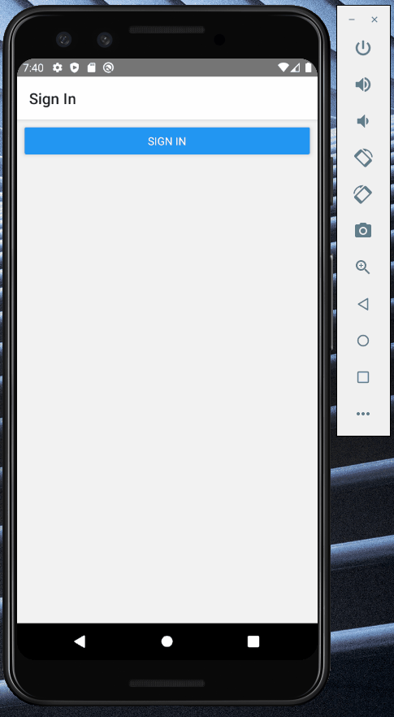

# Example of a user authenticaiton with the hosted UI of AWS Cognito and an Azure AD IdP
This example should give an overview how you can implement an authentication function in react native. 
The authentication should be done with AWS Cognito (without AWS Amplify) and an Azure AD identity provider (SAML2.0 and OpenID Connect).

It should just illustrate the interaction between React Native, AWS and Azure AD. Therefore, I didn't pay much attention to the UI in react native.
This example has only been tested for android.

## Runbook:
1. You need to enter your personal information in AuthManger.js and build.gradle (appAuthRedirectScheme: '[Your callback URL - no uppercase letters allowed]')
2. Configure utils/AuthManager.js 
3. Run the following code
```
npm install
npx react-native run-android
```

